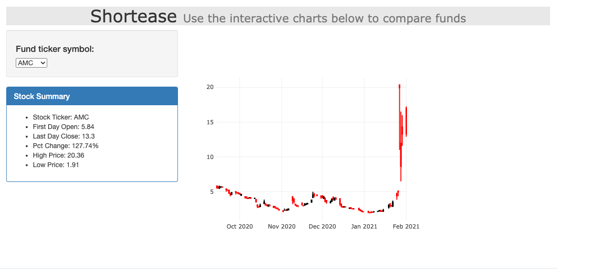
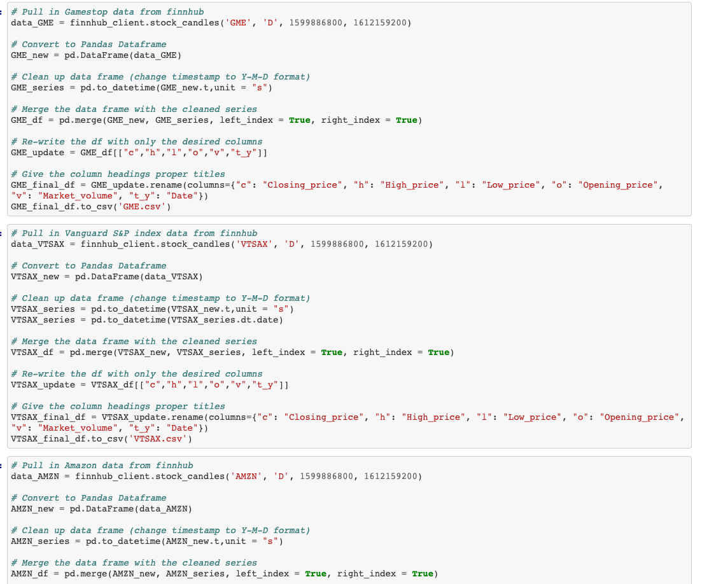
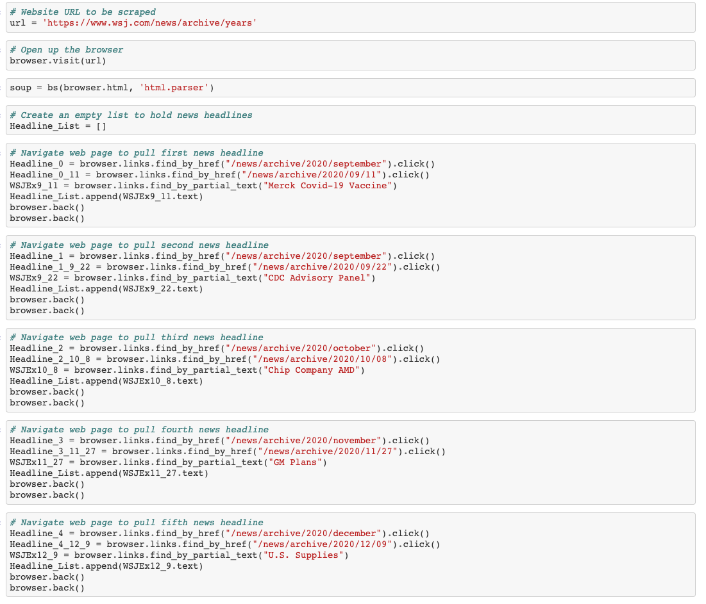
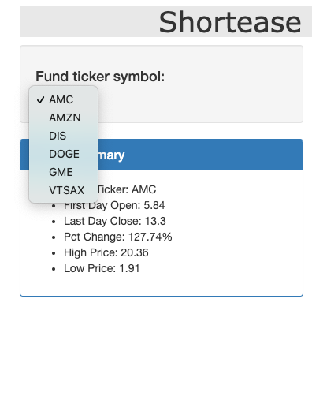
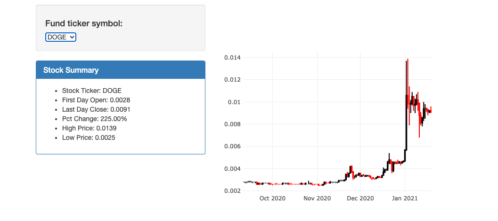
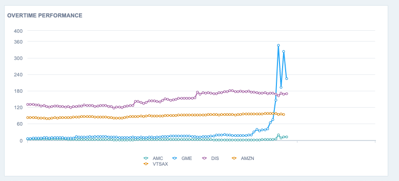

In this project, my team analyzes the difference between a varierty of stocks, mutual funds, cryptocurrency, and index funds. 

Of interest are those funds that were affected by the 'short squeeze' that occurred in late January and and early February. The funds that were directly affected by the short squeeze were Gamestop (GME), AMC Entertainment (AMC), and Dogecoin (DOGE). As you can see from the first image, there was a huge spike in AMC in late Jnuary or early February. 

What were some of the causes of these spikes? We begin by pulling in raw data using the Finnhub API and cleaning up our data using the Python library Pandas. Using Jupyter notebook, we create a notebook file that accomplishes this for us.

After our data frames are cleaned up and exported as csv files, we being scraping the Wall Street Journal website to pull out news headlines that may indicate why there may be changes in the stock market.

Next we turn our attention to JavaScript to write code that will begin the visualization process. Using D3 library, we are able to pull in csv files and create a dropdown menu, and with a combination of D3 and plotly, we create candlestick charts to show the behavior of each of the funds that are of interest.

 

Our last major visualization uses a JavaScript library called 'Zingchart', and here we are able to create a linear plot of all the stocks and show them on a single set of axis. This allows us to compare each of the stocks and see which of them were affected by the 'short squeeze'.

With the aid of a Python Flask app, HTML code, Bootstrap and CSS, we are able to clean up our webpage and give it the final touches.
